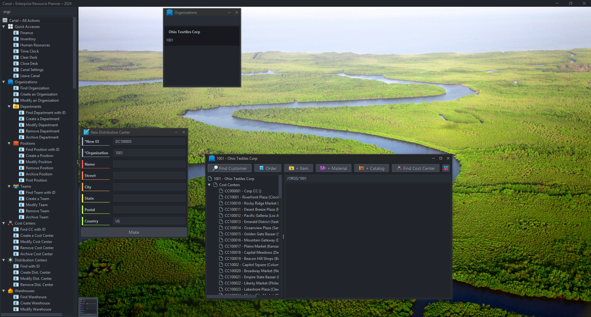

# Building In-Progress
## Canal – An SAP Alternative

Canal is an Open Source modular design Enterprise Resource Planning (ERP) system from A-Z once all basic functionality is completed. Regardless of any architecture decision, any ERP will be complex in nature for both code and documentation. It's almost perfect that an ERP be publicly owned and built.

Each 'module' is a transaction code called a Locke. There's a list of all Locke codes as `Transaction Codes.xlsx` in ~/Documentation.

### Current Operations
At the moment, Canal is limited in its abilities but can create organizational structures and commit the buying process up to creating a Goods Receipt upon receiving. This project is in its infancy. Current storage mechanism is through a folder in ~/Users/username/Roaming and unencrypted.

**GOAL:** Encrypted object storage with AES on Roaming folder or through AWS.

### Lack of OOP?
You'll notice a HEAVY lack of Object-Oriented Programming. This was intentionally done to enable customiziation on any Locke without having to make too many architectural changes during the implementation process.

### Contributing
It is appreciated if all contributions are as enhancments and single-feature based. Change a single screw or gear at a time. An example enhancement could be committed as 'Enhancement to /ORDS/NEW vendor selector'.

Any large build out or new process implementation should be a 'Project' and commit as 'Project `PROJECT_NAME`'. If you want to enable connections with AutoStore, do 'Project AutoStore'.

### Getting Started
_This will be a simple installation. Detailed to come._

First load of Canal will present a setup view with no Locke code. Check 'New Install?' and import a zip file if you'd like but this assumes not. Ignore the 'Server' and 'Configuration' tabs.

